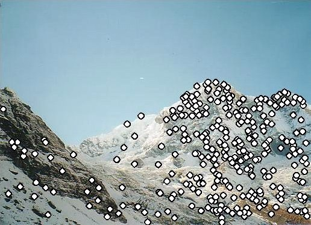

# [Automatic Panoramic Image Stitching using Invariant Features](https://link.springer.com/article/10.1007/s11263-006-0002-3)

> Matthew Brown and David G. Lowe {mbrown|lowe}@cs.ubc.ca Department of Computer Science, University of British Columbia, Vancouver, Canada

# Abstract

> *This paper concerns the problem of fully automated panoramic image stitching. Though the 1D problem (single axis of rotation) is well studied, 2D or multi-row stitching is more difficult. Previous approaches have used -human input or restrictions on the image sequence in order to establish matching images. In this work, we formulate stitching as a multi-image matching problem, and use invariant local features to find matches between all of the images. Because of this our method is insensitive to the ordering, orientation, scale and illumination of the input images. It is also insensitive to noise images that are not part of a panorama, and can recognise multiple panoramas in an unordered image dataset. In addition to providing more detail, this paper extends our previous work in the area [BL03] by introducing gain compensation and automatic straightening steps.*

本文关注全自动全景图像拼接问题。尽管1D问题（单轴旋转）已经被广泛研究，但2D或多行拼接更为困难。以前的方法使用人工输入或对图像序列的限制来建立匹配图像。在这项工作中，我们将拼接表述为一个多图像匹配问题，并使用不变的局部特征来找到所有图像之间的匹配。因此，我们的方法对输入图像的顺序、方向、比例和光照不敏感。它还对不属于全景图的噪声图像不敏感，并且可以在无序图像数据集中识别多个全景图。除了提供更多细节外，本文通过引入增益补偿和自动校正步骤扩展了我们在该领域的先前工作[BL03]。

## 1. Introduction

> Panoramic image stitching has an extensive research literature [Sze04, Mil75, BL03] and several commercial applications [Che95, REA, MSF]. The basic geometry of the problem is well understood, and consists of estimating a 3 × 3 camera matrix or homography for each image [HZ04, SS97]. This estimation process needs an initialisation, which is typically provided by user input to approximately align the images, or a fixed image ordering. For example, the PhotoStitch software bundled with Canon digital cameras requires a horizontal or vertical sweep, or a square matrix of images. REALVIZ Stitcher version 4 [REA] has a user interface to roughly position the images with a mouse, before automatic registration proceeds. Our work is novel in that we require no such initialisation to be provided.

全景图像拼接有着广泛的研究文献[Sze04, Mil75, BL03]和若干商业应用[Che95, REA, MSF]。问题的基本几何结构已经被很好地理解，并且包括为每个图像估计一个3×3的相机矩阵或单应性[HZ04, SS97]。这个估计过程需要初始化，通常由用户输入提供，以大致对齐图像，或固定图像顺序。例如，佳能数码相机捆绑的PhotoStitch软件需要水平或垂直扫描，或图像的方阵。REALVIZ Stitcher版本4[REA]有一个用户界面，可以用鼠标大致定位图像，然后进行自动配准。我们的工作新颖之处在于我们不需要提供这样的初始化。

> In the research literature methods for automatic image alignment and stitching fall broadly into two categories --- direct [SK95, IA99, SK99, SS00] and feature based [ZFD97, CZ98, MJ02]. Direct methods have the advantage that they use all of the available image data and hence can provide very accurate registration, but they require a close initialisation. Feature based registration does not require initialisation, but traditional feature matching methods (e.g., correlation of image patches around Harris corners [Har92, ST94]) lack the invariance properties needed to enable reliable matching of arbitrary panoramic image sequences.

在研究文献中，自动图像对齐和拼接的方法大致分为两类——直接法[SK95, IA99, SK99, SS00]和基于特征的方法[ZFD97, CZ98, MJ02]。直接法的优点是它们使用所有可用的图像数据，因此可以提供非常精确的配准，但它们需要紧密的初始化。基于特征的配准不需要初始化，但传统的特征匹配方法（例如，Harris角点周围图像块的相关性[Har92, ST94]）缺乏实现任意全景图像序列可靠匹配所需的不变性。

> In this paper we describe an invariant feature based approach to fully automatic panoramic image stitching. This has several advantages over previous approaches. Firstly, our use of invariant features enables reliable matching of panoramic image sequences despite rotation, zoom and illumination change in the input images. Secondly, by viewing image stitching as a multi-image matching problem, we can automatically discover the matching relationships between the images, and recognise panoramas in unordered datasets. Thirdly, we generate high-quality results using multi-band blending to render seamless output panoramas. This paper extends our earlier work in the area [BL03] by introducing gain compensation and automatic straightening steps. We also describe an efficient bundle adjustment implementation and show how to perform multi-band blending for multiple overlapping images with any number of bands.

在本文中，我们描述了一种基于不变特征的全自动全景图像拼接方法。这比以前的方法有几个优点。
首先，我们使用不变特征使得全景图像序列的可靠匹配成为可能，即使输入图像中存在旋转、缩放和光照变化。
其次，通过将图像拼接视为一个多图像匹配问题，我们可以自动发现图像之间的匹配关系，并在无序数据集中识别全景图。
第三，我们使用多带混合生成高质量的无缝输出全景图。
本文通过引入增益补偿和自动校正步骤扩展了我们在该领域的先前工作[BL03]。我们还描述了一种高效的捆绑调整实现，并展示了如何对多个重叠图像进行multi-band混合，无论bands的大小。

> The remainder of the paper is structured as follows. Section 2 develops the geometry of the problem and motivates our choice of invariant features. Section 3 describes our image matching methodology (RANSAC) and a probabilistic model for image match verification. In section 4 we describe our image alignment algorithm (bundle adjustment) which jointly optimises the parameters of each camera. Sections 5 - 7 describe the rendering pipeline including automatic straightening, gain compensation and multi-band blending. In section 9 we present conclusions and ideas for future work.

本文的其余部分结构如下。第2节发展了问题的几何结构，并激发了我们选择不变特征的动机。第3节描述了我们的图像匹配方法（RANSAC）和图像匹配验证的概率模型。在第4节中，我们描述了我们的图像对齐算法（捆绑调整），它共同优化每个相机的参数。第 5 - 7 节描述了渲染管道，包括自动校正、增益补偿和多带混合。在第9节中，我们提出了结论和未来工作的想法。

## 2. Feature Matching

> The first step in the panoramic recognition algorithm is to extract and match SIFT [Low04] features between all of the images. SIFT features are located at scale-space maxima/minima of a difference of Gaussian function. At each feature location, a characteristic scale and orientation is established. This gives a similarity-invariant frame in which to make measurements. Although simply sampling intensity values in this frame would be similarity invariant, the invariant descriptor is actually computed by accumulating local gradients in orientation histograms. This allows edges to shift slightly without altering the descriptor vector, giving some robustness to affine change. This spatial accumulation is also important for shift invariance, since the interest point locations are typically only accurate in the 0-3 pixel range [BSW05, SZ03]. Illumination invariance is achieved by using gradients (which eliminates bias) and normalising the descriptor vector (which eliminates gain).

全景识别算法的第一步是在所有图像之间提取并匹配SIFT [Low04] 特征。SIFT特征是通过高斯差分函数的尺度空间极值点（最大值/最小值）定位的。在每个特征位置，都会确定一个特征尺度和方向。这为测量提供了一个相似性不变的框架。虽然在该框架中简单采样强度值是相似性不变的，但实际的特征描述符是通过累积局部梯度到方向直方图中计算的。这样可以使边缘稍微移动时不会改变描述符向量，从而对仿射变化具有一定的鲁棒性。这种空间累积对于平移不变性也很重要，因为兴趣点的位置通常只能达到0-3像素的精度 [BSW05, SZ03]。通过使用梯度（消除偏置）和归一化特征描述符向量（消除增益），实现了光照不变性。

> Since SIFT features are invariant under rotation and scale changes, our system can handle images with varying orientation and zoom (see figure 8). Note that this would not be possible using traditional feature matching techniques such as correlation of image patches around Harris corners. Ordinary (translational) correlation is not invariant under rotation, and Harris corners are not invariant to changes in scale.

由于SIFT特征对旋转和尺度变化具有不变性，因此我们的系统可以处理具有不同方向和缩放的图像（见图8）。请注意，使用传统的特征匹配技术（如围绕Harris角点的图像块相关性）是无法做到这一点的。普通相关性平移（平移）对旋转不具备不变性，而Harris角点对尺度变化也不具备不变性。

> Assuming that the camera rotates about its optical centre, the group of transformations the images may undergo is a special group of homographies. We parameterise each camera by a rotation vector $\theta = [\theta_1, \theta_2, \theta_3]$ and focal length $f$. This gives pairwise homographies $\widetilde{u}_i = H_{ij} \widetilde{u}_j$ where
>
> $$ H_{ij} = K_i R_i R_j^{-1} K_j^{-1} \tag{1} $$
>
> and $\widetilde{u}_i, \widetilde{u}_j$ are the homogeneous image positions ($\widetilde{u}_i = s_i [u_i, 1]$, where $u_i$ is the 2-dimensional image position). The 4 parameter camera model is defined by
>
> $$K_i = \begin{bmatrix} f_i & 0 & 0 \\ 0 & f_i & 0 \\ 0 & 0 & 1  \end{bmatrix} \tag{2} $$
>
> and (using the exponential representation for rotations)
>
> $$ R_i = e^{[\theta_i]_\times}, \quad [\theta_i]_\times = \begin{bmatrix} 0 & -\theta_{i3} & \theta_{i2} \\ \theta_{i3} & 0 & -\theta_{i1} \\ -\theta_{i2} & \theta_{i1} & 0 \end{bmatrix} \tag{3} $$
>
> Ideally one would use image features that are invariant under this group of transformations. However, for small changes in image position
>
> $$ u_i = u_{i0} + \frac{\partial u_i}{\partial u_{j}} \bigg|_{u_{i0}} \Delta u_j \tag{4} $$
>
> or equivalently $\widetilde{u}_i = A_{ij} \widetilde{u}_j$ where
>
> $$ A_{ij} = \begin{bmatrix} a_{11} & a_{12} & a_{13} \\ a_{21} & a_{22} & a_{23} \\ 0 & 0 & 1 \end{bmatrix} \tag{5} $$
>
> is an affine transformation obtained by linearising the homography about $u_{i0}$. This implies that each small image patch undergoes an affine transformation, and justifies the use of SIFT features which are partially invariant under affine change.

假设相机绕其光学中心旋转，图像可能经历了一组特殊的单应性变换。我们通过旋转向量 $\theta = [\theta_1, \theta_2, \theta_3]$ 和焦距 $f$ 对每个相机进行参数化。这给出了成对的单应性 $\widetilde{u}_i = H_{ij} \widetilde{u}_j$，其中

$$
H_{ij} = K_i R_i R_j^{-1} K_j^{-1}
\tag{1}
$$

并且 $\widetilde{u}_i, \widetilde{u}_j$ 是齐次图像位置（$\widetilde{u}_i = s_i [u_i, 1]$，其中 $u_i$ 是二维图像位置）。四参数相机模型定义为

$$
K_i =
  \begin{bmatrix}
    f_i & 0 & 0 \\
    0 & f_i & 0 \\
    0 & 0 & 1
  \end{bmatrix}
\tag{2}
$$

并且（使用旋转的指数表示法）

$$
R_i = e^{[\theta_i]_\times},
\quad [\theta_i]_\times =
  \begin{bmatrix}
    0 & -\theta_{i3} & \theta_{i2} \\
    \theta_{i3} & 0 & -\theta_{i1} \\
    -\theta_{i2} & \theta_{i1} & 0
  \end{bmatrix}
\tag{3}
$$

理想情况下，会使用在这一组变换下不变的图像特征。然而，对于图像位置的微小变化，可以表示为

$$
u_i = u_{i0} + \frac{\partial u_i}{\partial u_{j}} \bigg|_{u_{i0}} \Delta u_j
\tag{4}
$$

或等效地 $\widetilde{u}_i = A_{ij} \widetilde{u}_j$ ，其中

$$
A_{ij} =
  \begin{bmatrix}
    a_{11} & a_{12} & a_{13} \\
    a_{21} & a_{22} & a_{23} \\
    0 & 0 & 1
  \end{bmatrix}
\tag{5}
$$

是通过在 $u_{i0}$ 处线性化单应性获得的仿射变换。这意味着每个小图像块都经历了仿射变换，表明在仿射变换下使用SIFT特征求取不变点是合理的。

> Once features have been extracted from all $n$ images (linear time), they must be matched. Since multiple images may overlap a single ray, each feature is matched to its $k$ nearest neighbours in feature space (we use $k = 4$). This can be done in $O(n \log n)$ time by using a k-d tree to find approximate nearest neighbours [BL97]. A k-d tree is an axis aligned binary space partition, which recursively partitions the feature space at the mean in the dimension with highest variance.

一旦从所有 $n$ 张图像（线性）中提取了特征，就需要对这些特征进行匹配。由于多张图像可能覆盖同一条射线，每个特征会在特征空间内与其 $k$ 个最近邻进行匹配（我们使用 $k = 4$）。这可以通过使用 k-d 树来找到近似的最近邻，以 $O(n \log n)$ 的时间完成 [BL97]。k-d 树是一种轴对齐的二元空间分割结构，它通过在最高方差的维度上以均值递归地划分特征空间。

## 3. Image Matching

> At this stage the objective is to find all matching (i.e. overlapping) images. Connected sets of image matches will later become panoramas. Since each image could potentially match every other one, this problem appears at first to be quadratic in the number of images. However, it is only necessary to match each image to a small number of overlapping images in order to get a good solution for the image geometry.

在这个阶段，目标是找到所有匹配（即重叠）的图像。图像匹配的连通集将成为后续的全景图。由于每张图像可能与其他任意图像匹配，起初这个问题看起来是图像数量的二次方复杂度。然而，为了获得图像几何的最优解，实际上只需将每张图像与少量重叠的图像进行匹配即可。

> From the feature matching step, we have identified images that have a large number of matches between them. We consider a constant number $m$ images, that have the greatest number of feature matches to the current image, as potential image matches (we use $m = 6$). First, we use RANSAC to select a set of inliers that are compatible with a homography between the images. Next we apply a probabilistic model to verify the match.

在特征匹配步骤中，我们已经确定了具有大量匹配点的图像。我们选择具有最多特征匹配的常数数量 $m$ 张图像作为当前图像的潜在匹配图像（我们使用 $m = 6$）。首先，我们使用RANSAC（随机采样一致性）算法选择与图像之间的单应性兼容的一组内点。接下来，我们应用概率模型来验证匹配结果的有效性。

### 3.1 Robust Homography Estimation using RANSAC

> RANSAC (Random Sample Consensus) [FB81] is a robust estimation procedure that uses a minimal set of randomly sampled correspondences to estimate image transformation parameters, and finds a solution that has the best consensus with the data. In the case of panoramas we select sets of $r = 4$ feature correspondences and compute the homography $\mathbf{H}$ between them using the direct linear transformation (DLT) method [HZ04]. We repeat this with $n = 500$ trials and select the solution that has the maximum number of inliers (whose projections are consistent with $\mathbf{H}$ within a tolerance $\epsilon$ pixels). Given the probability that a feature match is correct between a pair of matching images (the inlier probability) is $p_i$, the probability of finding the correct transformation after $n$ trials is
>
> $$ p(\mathbf{H} \text{ is correct}) = 1 - (1 - (p_i)^r)^n \tag{6} $$
>
> After a large number of trials the probability of finding the correct homography is very high. For example, for an inlier probability $p_i = 0.5$, the probability that the correct homography is not found after 500 trials is approximately $1 \times 10^{-14}$.

RANSAC（随机一致性采样）[FB81]是一种鲁棒估计程序，它利用一组随机抽样的最小对应点来估计图像变换参数，并找到与数据一致性最佳的解。在全景图的情况下，我们选择 $r = 4$ 个特征对应点，并使用直接线性变换（DLT）方法 [HZ04] 计算它们之间的单应矩阵 $\mathbf{H}$。我们重复这一过程进行 $n = 500$ 次试验，并选择内点数量最多的解（这些内点的投影与 $\mathbf{H}$ 在容差 $\epsilon$ 像素范围内一致）。

给定特征匹配在一对匹配图像间正确的概率（内点概率）为 $p_i$，在 $n$ 次试验后找到正确变换的概率为：

$$
p(\mathbf{H} \text{ is correct}) = 1 - (1 - (p_i)^r)^n
\tag{6}
$$

经过大量试验后，找到正确单应矩阵的概率非常高。例如，对于内点概率 $p_i = 0.5$，在 500 次试验后未找到正确单应矩阵的概率约为 $1 \times 10^{-14}$。

> RANSAC is essentially a sampling approach to estimating $\mathbf{H}$. If instead of maximising the number of inliers one maximises the sum of the log likelihoods, the result is maximum likelihood estimation (MLE). Furthermore, if priors on the transformation parameters are available, one can compute a maximum a posteriori estimate (MAP). These algorithms are known as MLESAC and MAPSAC respectively [Torr02].

RANSAC 实质上是一种通过采样来估计 $\mathbf{H}$ 的方法。如果不是最大化内点的数量，而是最大化对数似然的总和，则结果是最大似然估计（MLE）。此外，如果有关于变换参数的先验信息，可以计算最大后验概率估计（MAP）。这些算法分别称为 MLESAC 和 MAPSAC [Torr02]。
### 3.2 Probabilistic Model for Image Match Verification

> For each pair of potentially matching images we have a set of feature matches that are geometrically consistent (RANSAC inliers) and a set of features that are inside the area of overlap but not consistent (RANSAC outliers). The idea of our verification model is to compare the probabilities that this set of inlier/outliers was generated by a correct image match or by a false image match.

对于每对潜在匹配的图像，我们有一组几何一致的特征匹配（RANSAC 内点）和一组位于重叠区域内但不一致的特征（RANSAC 外点）。我们验证模型的思路是比较以下两种情况下的概率：这组内点/外点是由正确的图像匹配生成的，还是由错误的图像匹配生成的。

> For a given image we denote the total number of features in the area of overlap $n_f$ and the number of inliers $n_i$. The event that this image matches correctly/incorrectly is represented by the binary variable $m \in \{0, 1\}$. The event that the $i^{th}$ feature match $f^{(i)} \in \{0, 1\}$ is an inlier/outlier is assumed to be independent Bernoulli, so that the total number of inliers is Binomial
>
> $$ \begin{align} p(f^{(1:n_f)}|m = 1) = B(n_i; n_f, p_1) \tag{7} \\ p(f^{(1:n_f)}|m = 0) = B(n_i; n_f, p_0) \tag{8} \end{align} $$
>
> where $p_1$ is the probability a feature is an inlier given a correct image match, and $p_0$ is the probability a feature is an inlier given a false image match. The set of feature match variables $\{f^{(i)}, i = 1, 2, \ldots, n_f\}$ is denoted $f^{(1:n_f)}$. The number of inliers $n_i = \sum_{i=1}^{n_f} f^{(i)}$ and $B(\cdot)$ is the Binomial distribution
>
> $$ B(x; n, p) = \frac{n!}{x!(n - x)!} p^x (1 - p)^{n - x} \tag{9} $$
>
> We choose values $p_1 = 0.6$ and $p_0 = 0.1$. We can now evaluate the posterior probability that an image match is correct using Bayes' Rule
>
>$$ \begin{align} p(m = 1|f^{(1:n_f)}) &= \frac{p(f^{(1:n_f)}|m = 1)p(m = 1)}{p(f^{(1:n_f)})} \tag{10} \\ \\ &= \frac{1}{1 + \frac{p(f^{(1:n_f)}|m = 0)p(m = 0)}{p(f^{(1:n_f)}|m = 1)p(m = 1)}} \tag{11} \end{align} $$
>
> We accept an image match if $p(m = 1|f^{(1:n_f)}) > p_{\min}$
>
> $$ \frac{B(n_i; n_f, p_1)p(m = 1)}{B(n_i; n_f, p_0)p(m = 0)} \begin{array}{c} \text{accept} \\ \gtrless \\ \text{reject} \end{array} \frac{1} { {\frac{1} {p_{\min}}} - 1} \tag{12} $$
>
> Choosing values $p(m = 1) = 10^{-6}$ and $p_{\min} = 0.999$ gives the condition
>
> $$ n_i > \alpha + \beta n_f \tag{13} $$
>
> for a correct image match, where $\alpha = 8.0$ and $\beta = 0.3$. Though in practice we have chosen values for $p_0, p_1, p(m = 0), p(m = 1)$ and $p_{\min}$, they could in principle be learnt from the data. For example, $p_1$ could be estimated by computing the fraction of matches consistent with correct homographies over a large dataset.

对于给定的图像，我们用 $n_f$ 表示重叠区域内的特征总数，用 $n_i$ 表示内点的数量。图像匹配正确或错误的事件由二元变量 $m \in \{0, 1\}$ 表示。第 $i$ 个特征匹配 $f^{(i)} \in {0, 1}$ 是内点或外点的事件被假设为独立的伯努利分布，因此内点的总数服从二项分布：

$$
\begin{align}
  p(f^{(1:n_f)}|m = 1) = B(n_i; n_f, p_1)
  \tag{7} \\ \\
  p(f^{(1:n_f)}|m = 0) = B(n_i; n_f, p_0)
  \tag{8}
\end{align}
$$

其中，$p_1$ 是图像匹配正确时特征为内点的概率，而 $p_0$ 是图像匹配错误时特征为内点的概率。特征匹配变量的集合 $\{f^{(i)}, i = 1, 2, \ldots, n_f\}$ 表示为 $f^{(1:n_f)}$。内点的数量 $n_i = \sum_{i=1}^{n_f} f^{(i)}$ 和 $B(\cdot)$ 符合二项分布，

$$
B(x; n, p) = \frac{n!}{x!(n - x)!} p^x (1 - p)^{n - x}
\tag{9}
$$

我们选择 $p_1 = 0.6$ 和 $p_0 = 0.1$ 。现在，可以使用贝叶斯定理来评估图像匹配正确的后验概率

$$
\begin{align}
  p(m = 1|f^{(1:n_f)})
    &= \frac{p(f^{(1:n_f)}|m = 1)p(m = 1)}{p(f^{(1:n_f)})}
    \tag{10} \\ \\
    &= \frac{1}{1 + \frac{p(f^{(1:n_f)}|m = 0)p(m = 0)}{p(f^{(1:n_f)}|m = 1)p(m = 1)}}
    \tag{11}
\end{align}
$$

如果 $p(m = 1|f^{(1:n_f)}) > p_{\min}$ 则接受该图像匹配结果

$$
\frac{B(n_i; n_f, p_1)p(m = 1)}{B(n_i; n_f, p_0)p(m = 0)}
  \begin{array}{c}
    \text{accept} \\
    \gtrless \\
    \text{reject}
  \end{array} 
\frac{1} { {\frac{1} {p_{\min}}} - 1}
\tag{12}
$$

选择 $p(m = 1) = 10^{-6}$ 和 $p_{\min} = 0.999$ 的值，可以简化

$$
n_i > \alpha + \beta n_f
\tag{13}
$$

作为正确的图像匹配，其中 $\alpha = 8.0$ 和 $\beta = 0.3$ 。

虽然在实践中选择了 $p_0, p_1, p(m = 0), p(m = 1)$ 和 $p_{\min}$ ，但这些值理论上可以从数据中学习得到。例如，$p_1$ 可以通过计算在大规模数据集中与正确单应性一致的匹配的比例来估计。

> Once pairwise matches have been established between images, we can find panoramic sequences as connected sets of matching images. This allows us to recognise multiple panoramas in a set of images, and reject noise images which match to no other images (see figure 2).

一旦在图像之间建立了成对的匹配，我们就可以通过连接的匹配图像集来找到全景序列。这使我们能够在图像集内识别多个全景，并排除那些不与其他图像匹配的噪声图像（见图 2）。

---

  

    
    
<em>(a) Image 1</em>

  

  

    
    
<em>(b) Image 2</em>

  

   
   

  

    
    
<em>(c) SIFT matches 1</em>

  

  

    
    
<em>(d) SIFT matches 2</em>

  

   
   

  

    
    
<em>(e) RANSAC inliers 1</em>

  

  

    
    
<em>(f) RANSAC inliers 2</em>

  

   
   

   

    
    
<em>(g) Images aligned according to a homography</em>

  

  Figure 1. SIFT features are extracted from all of the images. After matching all of the features using a k-d tree, the m
  images with the greatest number of feature matches to a given image are checked for an image match. First RANSAC
  is performed to compute the homography, then a probabilistic model is invoked to verify the image match based on the
  number of inliers. In this example the input images are 517 × 374 pixels and there are 247 correct feature matches.

  图 1. 从所有图像中提取 SIFT 特征。通过使用 k-d 树匹配所有特征后，
  检查与给定图像特征匹配数量最多的 m 张图像是否存在图像匹配。
  首先使用 RANSAC 计算单应性，然后调用概率模型根据内点数量验证图像匹配。
  在此示例中，输入图像为 517 × 374 像素，且有 247 个正确的特征匹配。

  

    
  

   
   

  

    
  

  

    
  

  Figure2.Recognisingpanoramas. Givenanoisysetoffeaturematches, weuseRANSACandaprobabilisticverification
  procedure to find consistent image matches (a). Each arrow between a pair of images indicates that a consistent set of
  feature matches was found between that pair. Connected components of image matches are detected (b) and stitched
  into panoramas (c). Note that the algorithm is insensitive to noise images that do not belong to a panorama (connected
  components of size 1 image).

  图 2. 识别全景图。给定一组嘈杂的特征匹配，我们使用 RANSAC 和概率验证程序来寻找一致的图像匹配（a）。
  每对图像之间的箭头表示在这对图像之间找到了一个一致的特征匹配集。
  检测到图像匹配的连通组件（b），并将其拼接成全景图（c）。
  请注意，该算法对不属于全景图的噪声图像（大小为 1 图像的连通组件）不敏感。

---

## 4. Bundle Adjustment

> Given a set of geometrically consistent matches between the images, we use bundle adjustment [TMHF99] to solve for all of the camera parameters jointly. This is an essential step as concatenation of pairwise homographies would cause accumulated errors and disregard multiple constraints between images, e.g. that the ends of a panorama should join up. Images are added to the bundle adjuster one by one, with the best matching image (maximum number of consistent matches) being added at each step. The new image is initialised with the same rotation and focal length as the image to which it best matches. Then the parameters are updated using Levenberg-Marquardt.

在图像之间具有几何一致的匹配的情况下，我们使用 **bundle adjustment** [TMHF99] 来联合求解所有相机参数。这是一个关键步骤，因为简单地连接成对的单应性矩阵会导致累计误差，并忽略图像之间的多个约束，例如全景的两端应当对接。每次将图像逐一添加到束调整器中，每一步都添加与当前图像匹配最好的图像（具有最多一致匹配）。新图像初始化时采用与最佳匹配图像相同的旋转和焦距，然后使用 Levenberg-Marquardt 算法更新参数。

> The objective function we use is a robustified sum squared projection error. That is, each feature is projected into all the images in which it matches, and the sum of squared image distances is minimised with respect to the camera parameters. Given a correspondence $u_i^k \leftrightarrow u_j^l$ (where $u_i^k$ denotes the position of the $k\text{th}$ feature in image $i$), the residual is
>
> $$ r_{ij}^k = u_i^k - p_{ij}^k \tag{14} $$
>
> where $p_{ij}^k$ is the projection from image $j$ to image $i$ of the point corresponding to $u_i^k$
>
> $$ \widetilde{p}_{ij}^k = K_i R_i R_j^{-1} K_j^{-1} \widetilde{u}_j^l \tag{15} $$
>
> The error function is the sum over all images of the robustified residual errors
>
> $$ e = \sum_{i=1}^n \sum_{j \in \mathcal{I}(i)} \sum_{k \in \mathcal{F}(i,j)} h(r_{ij}^k) \tag{16} $$
>
> where $n$ is the number of images, $\mathcal{I}(i)$ is the set of images matching to image $i$, $\mathcal{F}(i,j)$ is the set of feature matches between images $i$ and $j$. We use a Huber robust error function [Hub81]
>
> $$ h(x) = \begin{cases} |x|^2, & \text{if } |x| < \sigma \\ 2\sigma |x| - \sigma^2, & \text{if } |x| \geq \sigma \end{cases} \tag{17} $$
>
> This error function combines the fast convergence properties of an $L_2$ norm optimisation scheme for inliers (distance less than $\sigma$), with the robustness of an $L_1$ norm scheme for outliers (distance greater than $\sigma$). We use an outlier distance $\sigma = \infty$ during initialisation and $\sigma = 2$ pixels for the final solution.

我们使用的目标函数是经过鲁棒化的平方投影误差之和。即，每个特征被投影到所有匹配的图像中，并最小化图像距离的平方和，以优化相机参数。给定一个对应关系 $u_i^k \leftrightarrow u_j^l$（其中 $u_i^k$ 表示第 $k$ 个特征在图像 $i$ 中的位置），残差是

$$
r_{ij}^k = u_i^k - p_{ij}^k
\tag{14}
$$

其中 $p_{ij}^k$ 是将图像 $j$ 中的点 $u_i^k$ 投影到图像 $i$ 中的投影

$$
\widetilde{p}_{ij}^k = K_i R_i R_j^{-1} K_j^{-1} \widetilde{u}_j^l
\tag{15}
$$

误差函数是所有图像上的鲁棒残差误差之和

$$
e = \sum_{i=1}^n \sum_{j \in \mathcal{I}(i)} \sum_{k \in \mathcal{F}(i,j)} h(r_{ij}^k)
\tag{16}
$$

其中 $n$ 是图像的数量，$\mathcal{I}(i)$ 是与图像 $i$ 匹配的图像集合，$\mathcal{F}(i,j)$ 是图像 $i$ 和图像 $j$ 之间的特征匹配集合。我们使用 Huber 鲁棒误差函数 [Hub81]。

$$
h(x) =
\begin{cases}
  |x|^2, & \text{if } |x| < \sigma \\
  2\sigma |x| - \sigma^2, & \text{if } |x| \geq \sigma
\end{cases}
\tag{17}
$$

该误差函数结合了 $L_2$ 范数优化方案对内点（距离小于 $\sigma$）的快速收敛特性，以及 $L_1$ 范数方案对外点（距离大于 $\sigma$）的鲁棒性。在初始化阶段，我们使用的外点距离为 $\sigma = \infty$，最终解中使用 $\sigma = 2$ ~~像素~~。

> This is a non-linear least squares problem which we solve using the Levenberg-Marquardt algorithm. Each iteration step is of the form
>
> $$ \Phi = (J^T J + \lambda C_p^{-1})^{-1} J^T r \tag{18} $$
>
> where $\Phi$ are all the parameters, $r$ the residuals and $J = \partial r / \partial \Phi$. We encode our prior belief about the parameter changes in the (diagonal) covariance matrix $C_p$
>
> $$ C_p = \begin{bmatrix} \sigma_{\theta}^2 & 0 & 0 & 0 & 0 & \cdots \\ 0 & \sigma_{\theta}^2 & 0 & 0 & 0 & \cdots \\ 0 & 0 & \sigma_{\theta}^2 & 0 & 0 & \cdots \\ 0 & 0 & 0 & \sigma_f^2 & 0 & \cdots \\ 0 & 0 & 0 & 0 & \sigma_{\theta}^2 & \cdots \\ \vdots & \vdots & \vdots & \vdots & \ddots \end{bmatrix} \tag{19} $$
>
> This is set such that the standard deviation of angles is $\sigma_{\theta} = \pi / 16$ and focal lengths $\sigma_f = \bar{f} / 10$ (where $\bar{f}$ is the mean of the focal lengths estimated so far). This helps in choosing suitable step sizes, and hence speeding up convergence. For example, if a spherical covariance matrix were used, a change of 1 radian in rotation would be equally penalised as a change of 1 pixel in the focal length parameter. Finally, the $\lambda$ parameter is varied at each iteration to ensure that the objective function of equation 16 does in fact decrease.

这是一个非线性最小二乘问题，我们使用Levenberg-Marquardt算法来解决。每次迭代步骤的形式为

$$
\Phi = (J^T J + \lambda C_p^{-1})^{-1} J^T r
\tag{18}
$$

其中$\Phi$是总参数，$r$是残差，$J = \partial r / \partial \Phi$。我们将关于参数变化的先验信念编码在（对角）协方差矩阵 $C_p$ 中

$$
C_p =
\begin{bmatrix}
  \sigma_{\theta_0}^2 & 0 & 0 & 0 & \cdots \\
  0 & \sigma_{\theta_0}^2 & 0 & 0 & \cdots \\
  0 & 0 & \sigma_{\theta_0}^2 & 0 & \cdots \\
  0 & 0 & 0 & \sigma_f^2 & \cdots \\
  \vdots & \vdots & \vdots & \vdots & \ddots
\end{bmatrix}
\tag{19}
$$

这个设置使得角度的标准差为 $\sigma_{\theta} = \pi / 16$，焦距的标准差为 $\sigma_f = \bar{f} / 10$（其中 $\bar{f}$ 是到目前为止估计的焦距平均值）。这有助于选择合适的步长，从而加快收敛速度。例如，如果使用球形协方差矩阵，旋转角度变化 1 弧度将与焦距参数变化 1 像素受到相同的惩罚。最后，参数 $\lambda$ 在每次迭代中变化，以确保方程 (16) 的目标函数确实减少。

> The derivatives are computed analytically via the chain rule, for example
>
> $$ \frac{\partial p_{ij}^k}{\partial \theta_{i1}} = \frac{\partial p_{ij}^k}{\partial \widetilde{p}_{ij}^k} \frac{\partial \widetilde{p}_{ij}^k}{\partial \theta_{i1}} \tag{20} $$
>
> where
>
> $$ \frac{\partial p_{ij}^k}{\partial \widetilde{p}_{ij}^k} = \frac{\partial [x/z \;\;\; y/z]}{\partial [x \;\; y \;\; z]} = \begin{bmatrix} 1/z & 0 & -x/z^2 \\ 0 & 1/z & -y/z^2 \end{bmatrix} \tag{21} $$
>
> and
>
> $$ \begin{align} \frac{\partial \widetilde{p}_{ij}^k}{\partial \theta_{i1}} &= K_i \frac{\partial R_i}{\partial \theta_{i1}} R_j K_j^{-1} \widetilde{u}_j^l  \tag{22} \\  \frac{\partial R_i}{\partial \theta_{i1}} &= \frac{\partial}{\partial \theta_{i1}} e^{[\theta_i]_\times} = e^{[\theta_i]_\times} \begin{bmatrix} 0 & 0 & 0 \\ 0 & 0 & -1 \\ 0 & 1 & 0 \end{bmatrix}  \tag{23} \end{align} $$

通过链式法则计算导数，例如

$$
\frac{\partial \hat{p}_{ij}^k}{\partial \theta_{i,1}}
  = \frac{\partial \hat{p}_{ij}^k}{\partial p_{ij}^k}
    \frac{\partial p_{ij}^k}{\partial \theta_{i,1}}
\tag{20}
$$

其中

$$
\frac{\partial p_{ij}^k}{\partial p_{ij}^k}
  = \frac{\partial}{\partial [x \; y \; z]} \begin{bmatrix} x/z \\ y/z \end{bmatrix}
  = \begin{bmatrix} 1/z & 0 & -x/z^2 \\ 0 & 1/z & -y/z^2 \end{bmatrix}
\tag{21}
$$

和

$$
\begin{align}
\frac{\partial \widetilde{p}_{ij}^k}{\partial \theta_{i1}} &= K_i \frac{\partial R_i}{\partial \theta_{i1}} R_j K_j^{-1} \widetilde{u}_j^l 
\tag{22} \\ 
\frac{\partial R_i}{\partial \theta_{i1}} &= \frac{\partial}{\partial \theta_{i1}} e^{[\theta_i]_\times} = e^{[\theta_i]_\times} \begin{bmatrix} 0 & 0 & 0 \\ 0 & 0 & -1 \\ 0 & 1 & 0 \end{bmatrix} 
\tag{23}
\end{align}
$$

### 4.1 Fast Solution by Direct Computation of the Linear System

> Since the matrix $J$ is sparse, forming $J^T J$ by explicitly multiplying $J$ by its transpose is inefficient. In fact, this would be the most expensive step in bundle adjustment, costing $O(MN^2)$ for an $M \times N$ matrix $J$ ($M$ is twice the number of measurements and $N$ is the number of parameters). The sparseness arises because each image typically only matches to a small subset of the other images. This means that in practice each element of $J^T J$ can be computed in much fewer than $M$ multiplications
>
> $$ (J^T J)_{ij} = \sum_{k \in \mathcal{F}(i,j)} \frac{\partial \mathbf{r}_{ij}^k}{\partial \mathbf{\Phi}_i}^T \frac{\partial \mathbf{r}_{ij}^k}{\partial \mathbf{\Phi}_j} = \mathbf{C}_{\mathbf{\Phi}}^{-1} \tag{24} $$
>
> i.e., the inverse covariance between cameras $i$ and $j$ depends only on the residuals of feature matches between $i$ and $j$.

由于矩阵$J$是稀疏的，通过显式地将$J$乘以其转置来形成$J^T J$是低效的。事实上，这将是捆绑调整中最昂贵的步骤，对于$M \times N$矩阵$J$，其成本为$O(MN^2)$（$M$是测量次数的两倍，$N$是参数的数量）。稀疏性产生的原因是每个图像通常只与其他图像的一小部分匹配。这意味着在实践中$J^T J$的每个元素可以通过比$M$少得多的乘法计算

由于矩阵 $J$ 是稀疏的，显式地通过 $J$ 与其转置相乘来计算 $J^T J$ 效率低下。实际上，这是捆绑调整中最费时的步骤，对于一个 $M \times N$ 矩阵 $J$，其计算代价为 $O(MN^2)$（$M$ 是测量值的两倍，$N$ 是参数的数量）。稀疏性源于每个图像通常只与其他图像的一小部分匹配。这意味着在实践中，$J^T J$ 的每个元素可以通过远少于 $M$ 次乘法来计算得到

$$
 (J^T J)_{ij} = \sum_{k \in \mathcal{F}(i,j)} \frac{\partial \mathbf{r}_{ij}^k}{\partial \mathbf{\Phi}_i}^T \frac{\partial \mathbf{r}_{ij}^k}{\partial \mathbf{\Phi}_j} = \mathbf{C}_{\mathbf{\Phi}}^{-1} 
 \tag{24}
$$

也就是说，相机 $i$ 和 $j$ 之间的逆协方差仅依赖于 $i$ 和 $j$ 之间特征匹配的残差。

> Similarly, $J^T r$ need not be computed explicitly, but can be computed via
>
> $$ (J^T \mathbf{r})_i = \sum_{i=1}^{n} \sum_{j \in \mathcal{I}(i)} \sum_{k \in \mathcal{F}(i,j)} \frac{\partial \mathbf{r}_{ij}^k}{\partial \mathbf{\Phi}_i}^T \mathbf{r}_{ij}^k \tag{25} $$
>
> In both cases each summation would require $M$ multiplications if each feature matched to every single image, but in practice the number of feature matches for a given image is much less than this. Hence each iteration of bundle adjustment is $O(N^3)$, which is the cost of solving the $N \times N$ linear system. The number of parameters $N$ is 4 times the number of images, and typically $M$ is around 100 times larger than $N$.

同样，$J^T r$ 也不需要直接计算，而可以通过以下方式计算

$$
(J^T \mathbf{r})_i = \sum_{i=1}^{n} \sum_{j \in \mathcal{I}(i)} \sum_{k \in \mathcal{F}(i,j)} \frac{\partial \mathbf{r}_{ij}^k}{\partial \mathbf{\Phi}_i}^T \mathbf{r}_{ij}^k 
\tag{25}
$$

在这两种情况下，如果每个特征匹配到每一张图像，那么每个求和操作都需要 $M$ 次乘法，但实际上，每张图像的特征匹配数量远小于这个值。因此，每次捆绑调整的计算复杂度为 $O(N^3)$，这是求解 $N \times N$ 线性系统的代价。参数数量 $N$ 是图像数量的 4 倍，而 $M$ 通常是 $N$ 的 100 倍左右。

## 5. Automatic Panorama Straightening

> Image registration using the steps of sections 2 - 4 gives the relative rotations between the cameras, but there remains an unknown 3D rotation to a chosen world coordinate frame. If we simply assume that $R = I$ for one of the images, we typically find a wavy effect in the output panorama. This is because the real camera was unlikely to be perfectly level and un-tilted. We can correct this wavy output and automatically straighten the panorama by making use of a heuristic about the way people typically shoot panoramic images. The idea is that it is rare for people to twist the camera relative to the horizon, so the camera $X$ vectors (horizontal axis) typically lie in a plane (see figure 4). By finding the null vector of the covariance matrix of the camera $X$ vectors, we can find the "up-vector" $\mathbf{u}$ (normal to the plane containing the camera centre and the horizon)
>
> $$ \left( \sum_{i=1}^n \mathbf{X}_i \mathbf{X}_i^T \right) \mathbf{u} = 0 \tag{26} $$
>
> Applying a global rotation such that up-vector $\mathbf{u}$ is vertical (in the rendering frame) effectively removes the wavy effect from output panoramas as shown in figure 4.

使用第 2 至第 4 节中的步骤进行图像配准可以获得相机之间的相对旋转，但仍然存在一个未知的 3D 旋转到选择的世界坐标系。如果我们简单地假设一个图像的 $R = I$，通常会发现输出全景图有波浪效果。这是因为实际相机可能并不是完全水平且未倾斜的。我们可以通过利用关于人们拍摄全景图像的典型方式的启发式方法来纠正这种波浪效果并自动校正全景图。其思路是，人们通常不会相对于地平线旋转相机，因此相机 $X$ 轴（水平轴）通常位于一个平面内（见图 4）。通过找到相机 $X$ 轴向量协方差矩阵的零向量，我们可以找到“上向量” $\mathbf{u}$（垂直于包含相机中心和地平线的平面）

$$
\left( \sum_{i=1}^n \mathbf{X}_i \mathbf{X}_i^T \right) \mathbf{u} = 0
\tag{26}
$$

对全景图应用全局旋转，使得上向量 $\mathbf{u}$ 垂直（在渲染框架中），有效地消除了输出全景图中的波浪效果，如图 4 所示。

## 6. Gain Compensation

> In previous sections, we described a method for computing the geometric parameters (orientation and focal length) of each camera. In this section, we show how to solve for a photometric parameter, namely the overall gain between images. This is set up in a similar manner, with an error function defined over all images. The error function is the sum of gain normalised intensity errors for all overlapping pixels
>
> $$ e = \frac{1}{2} \sum_{i=1}^{n} \sum_{j=1}^{n} \sum_{\substack{\mathbf{u}_i \in \mathcal{R}(i,j) \\ \tilde{\mathbf{u}}_i = \mathbf{H}_{ij} \tilde{\mathbf{u}}_j}} \left( g_i I_i(\mathbf{u}_i) - g_j I_j(\mathbf{u}_j) \right)^2 \tag{27} $$
>
> where $g_i, g_j$ are the gains, and $\mathcal{R}(i,j)$ is the region of overlap between images $i$ and $j$. In practice we approximate $I(\mathbf{u}_i)$ by the mean in each overlapping region $\bar{I}_{ij}$
>
> $$ \bar{I}_{ij} = \frac{\sum_{\mathbf{u}_i \in \mathcal{R}(i,j)} I_i(\mathbf{u}_i)}{\sum_{\mathbf{u}_i \in \mathcal{R}(i,j)} 1} \tag{28} $$
>
> This simplifies the computation and gives some robustness to outliers, which might arise due to small misregistrations between the images. Also, since $g = 0$ is an optimal solution to the problem, we add a prior term to keep the gains close to unity. Hence the error function becomes
>
> $$ e = \frac{1}{2} \sum_{i=1}^n \sum_{j=1}^n N_{ij} \left( (g_i \bar{I}_{ij} - g_j \bar{I}_{ij})^2 / \sigma_N^2 + (1 - g_i)^2 / \sigma_g^2 \right) \tag{29} $$
>
> where $N_{ij} = |\mathcal{R}(i,j)|$ equals the number of pixels in image $i$ that overlap in image $j$. The parameters $\sigma_N$ and $\sigma_g$ are the standard deviations of the normalised intensity error and gain respectively. We choose values $\sigma_N = 10.0$ ($I \in \{0..255\}$) and $\sigma_g = 0.1$. This is a quadratic objective function in the gain parameters $g$ which can be solved in closed form by setting the derivative to 0 (see figure 5).

在前面的章节中，我们描述了计算每个相机几何参数（方向和焦距）的方法。在本节中，我们将展示如何解决一个光度参数问题，即图像之间的总体增益。这个问题的设置方式类似，定义了一个跨所有图像的误差函数。该误差函数是所有重叠像素的增益归一化强度误差的总和

$$
e = \frac{1}{2} \sum_{i=1}^{n} \sum_{j=1}^{n} \sum_{\substack{\mathbf{u}_i \in \mathcal{R}(i,j) \\ \tilde{\mathbf{u}}_i = \mathbf{H}_{ij} \tilde{\mathbf{u}}_j}} \left( g_i I_i(\mathbf{u}_i) - g_j I_j(\mathbf{u}_j) \right)^2 
\tag{27}
$$

其中 $g_i$ 和 $g_j$ 是增益，$\mathcal{R}(i,j)$ 是图像 $i$ 和 $j$ 之间的重叠区域。实际操作中，我们通过每个重叠区域中的均值 $\bar{I}_{ij}$ 来近似 $I(\mathbf{u}_i)$

$$
\bar{I}_{ij} = \frac{\sum_{\mathbf{u}_i \in \mathcal{R}(i,j)} I_i(\mathbf{u}_i)}{\sum_{\mathbf{u}_i \in \mathcal{R}(i,j)} 1}
\tag{28}
$$

这简化了计算并对可能由于图像之间的小误配而产生的异常值提供了一些鲁棒性。此外，由于 $g = 0$ 是问题的一个最优解，我们添加了一个先验项以保持增益接近于 1。因此，误差函数变为

$$
e = \frac{1}{2} \sum_{i=1}^n \sum_{j=1}^n N_{ij} \left( (g_i \bar{I}_{ij} - g_j \bar{I}_{ij})^2 / \sigma_N^2 + (1 - g_i)^2 / \sigma_g^2 \right)
\tag{29}
$$

其中 $N_{ij} = |\mathcal{R}(i,j)|$ 表示图像 $i$ 中与图像 $j$ 重叠的像素数量。参数 $\sigma_N$ 和 $\sigma_g$ 分别是归一化强度误差和增益的标准差。我们选择 $\sigma_N = 10.0$ （$I \in {0..255}$）和 $\sigma_g = 0.1$。这是一个关于增益参数 $g$ 的二次目标函数，可以通过将导数设为 0 以闭式形式求解（见图 5）

---

  

    
  

  Figure 3. Finding the up-vector u. A good heuristic to align wavy panoramas is to note that people rarely twist the
  camera relative to the horizon. Hence despite tilt (b) and rotation (c), the camera X vectors typically lie in a plane. The
  up-vector u (opposite to the direction of gravity) is the vector normal to this plane.

  图 3. 寻找上向量 $\mathbf{u}$。对齐波浪形全景图的一个有效启发式方法是注意到人们很少将相机相对于地平线旋转。
  因此，尽管有倾斜（b）和旋转（c），相机的 X 向量通常位于一个平面内。
  上向量 $\mathbf{u}$（与重力方向相反）是该平面的法向量。

   
   

  

    
     
<em>(a) Without automatic straightening</em>

  

 
   
   

  

    
    
<em>(b) With automatic straightening</em>

  

   
   

  Figure 4. Automatic panorama straightening. Using the heuristic that users rarely twist the camera relative to the
  horizon allows us to straighten wavy panoramas by computing the up-vector (perpendicular to the plane containing the
  horizon and the camera centre).

  图 4. 自动全景图校正。利用用户很少将相机相对于地平线旋转的启发式方法，
  我们可以通过计算上向量（垂直于包含地平线和相机中心的平面）来校正波浪形全景图。

---

---

  

    
     
<em>(a) Half of the images registered</em>

  

 
   
   

  

    
    
<em>(b) Without gain compensation</em>

  

   
   

  

    
    
<em>(c) With gain compensation</em>

  

   
   

  

    
    
<em>(d) With gain compensation and multi-band blending</em>

  

   
   

  Figure 5. Gain compensation. Note that large changes in brightness between the images are visible if gain compensation
  is not applied (a)-(b). After gain compensation, some image edges are still visible due to unmodelled effects such as
  vignetting (c). These can be effectively smoothed out using multi-band blending (d)

  图 5. 增益补偿。注意到如果不应用增益补偿，则图像之间的亮度变化较大（a）-（b）。
  在进行增益补偿后，由于未建模的效应如渐晕，一些图像边缘仍然可见（c）。
  这些可以通过多频带混合有效地平滑（d）。

---

## 7. Multi-Band Blending

> Ideally each sample (pixel) along a ray would have the same intensity in every image that it intersects, but in reality this is not the case. Even after gain compensation some image edges are still visible due to a number of unmodelled effects, such as vignetting (intensity decreases towards the edge of the image), parallax effects due to unwanted motion of the optical centre, mis-registration errors due to mis-modelling of the camera, radial distortion and so on. Because of this a good blending strategy is important.

理想情况下，射线上的每个样本（像素）在其交叉的每个图像中应具有相同的强度，但实际上并非如此。即使在增益补偿之后，由于未建模（如渐晕（图像边缘处强度降低）、由于光学中心的不期望运动产生的视差效应、由于相机建模误差产生的错位、径向畸变等），一些图像边缘仍然可见。因此，我们需要一个更好的融合方法。

> From the previous steps we have $n$ images $I^i(\theta, \phi)$ ($i \in \{1..n\}$) which, given the known registration, may be expressed in a common (spherical) coordinate system as $I^i(\theta, \phi)$. In order to combine information from multiple images we assign a weight function to each image $W^i(x, y) = w(x)w(y)$ where $w(x)$ varies linearly from 1 at the centre of the image to 0 at the edge. The weight functions are also resampled in spherical coordinates $W^i(\theta, \phi)$. A simple approach to blending is to perform a weighted sum of the image intensities along each ray using these weight functions
>
> $$ I^{\text{linear}}(\theta, \phi) = \frac{\sum_{i=1}^n I^i(\theta, \phi) W^i(\theta, \phi)}{\sum_{i=1}^n W^i(\theta, \phi)} \tag{30} $$
>
> where $I^{\text{linear}}(\theta, \phi)$ is a composite spherical image formed using linear blending. However, this approach can cause blurring of high frequency detail if there are small registration errors (see figure 7). To prevent this we use the multi-band blending algorithm of Burt and Adelson [BA83]. The idea behind multi-band blending is to blend low frequencies over a large spatial range, and high frequencies over a short range.

从前面的步骤中，我们有 $n$ 张图像 $I^i(\theta, \phi)$ （$i \in {1..n}$），这些图像在已知配准的情况下可以表示为共同的（球面）坐标系统中的 $I^i(\theta, \phi)$。为了结合来自多张图像的信息，我们为每张图像分配一个权重函数 $W^i(x, y) = w(x)w(y)$，其中 $w(x)$ 从图像中心的 1 线性变化到边缘的 0。这些权重函数也在球面坐标系中重新采样为 $W^i(\theta, \phi)$。一种简单的融合方法是使用这些权重函数对沿每条射线的图像强度进行加权求和

$$
I^{\text{linear}}(\theta, \phi) = \frac{\sum_{i=1}^n I^i(\theta, \phi) W^i(\theta, \phi)}{\sum_{i=1}^n W^i(\theta, \phi)}
\tag{30}
$$
其中 $I^{\text{linear}}(\theta, \phi)$ 是使用线性融合形成的复合球面图像。然而，如果存在小的配准误差，这种方法可能会导致高频细节模糊（见图 7）。为了防止这种情况，我们使用 Burt 和 Adelson [BA83] 的多频带融合算法。多频带融合的思想是对低频在较大空间范围内进行融合，对高频在较短范围内进行融合

其中$I^{\text{linear}}(\theta, \phi)$是使用线性混合形成的复合球面图像。然而，如果存在小的配准误差，这种方法会导致高频细节的模糊（见图7）。为了防止这种情况，我们使用Burt和Adelson的 Multi-Band 混合算法[BA83]。Multi-Band 混合的思想是在大空间范围内混合低频，在短范围内混合高频。

> We initialise blending weights for each image by finding the set of points for which image $i$ is most responsible
>
> $$ W_{\max}^i(\theta, \phi) = \begin{cases} 1, & \text{if } W^i(\theta, \phi) = \arg \max_j W^j(\theta, \phi) \\ 0, & \text{otherwise} \end{cases} \tag{31} $$
>
> i.e. $W_{\max}^i(\theta, \phi)$ is 1 for $(\theta, \phi)$ values where image $i$ has maximum weight, and 0 where some other image has a higher weight. These max-weight maps are successively blurred to form the blending weights for each band.

我们通过找到图像 $i$ 最负责的点集来初始化每个图像的混合权重

$$
W_{\max}^i(\theta, \phi) = \begin{cases}
  1, & \text{if } W^i(\theta, \phi) = \arg \max_j W^j(\theta, \phi) \\
  0, & \text{otherwise}
\end{cases}
\tag{31}
$$
即，对于图像 $i$ 拥有最大权重的 $(\theta, \phi)$ 值，$W_{\max}^i(\theta, \phi)$ 为 1，而在其他图像具有更高权重的地方为 0。这些最大权重图像会依次进行模糊处理，以形成每个 band 的融合权重。

> A high pass version of the rendered image is formed
>
> $$ \begin{align} B_\sigma^i(\theta, \phi) &= I^i(\theta, \phi) - I_\sigma^i(\theta, \phi) \tag{32} \\ \\ I_\sigma^i(\theta, \phi) &= I^i(\theta, \phi) * g_\sigma(\theta, \phi) \tag{33} \end{align} $$
>
> where $g_\sigma(\theta, \phi)$ is a Gaussian of standard deviation $\sigma$, and the $*$ operator denotes convolution. $B_\sigma(\theta, \phi)$ represents spatial frequencies in the range of wavelengths $\lambda \in [0, \sigma]$. We blend this band between images using a blending weight formed by blurring the max-weight map for this image
>
> $$ W_\sigma^i(\theta, \phi) = W_{\max}^i(\theta, \phi) * g_\sigma(\theta, \phi) \tag{34} $$
>
> where $W_\sigma^i(\theta, \phi)$ is the blend weight for the wavelength $\lambda \in [0, \sigma]$ band. Subsequent frequency bands are blended using lower frequency bandpass images and further blurring the blend weights, i.e. for $k \geq 1$
>
> $$ \begin{align} B_{(k+1)\sigma}^i &= I_{k\sigma}^i - I_{(k+1)\sigma}^i \tag{35} \\ \\ I_{(k+1)\sigma}^i &= I_{k\sigma}^i * g_{\sigma'} \tag{36} \\ \\ W_{(k+1)\sigma}^i &= W_{k\sigma}^i * g_{\sigma'} \tag{37} \end{align} $$
>
> where the standard deviation of the Gaussian blurring kernel $\sigma' = \sqrt{(2k + 1)}\sigma$ is set such that subsequent bands have the same range of wavelengths.

基于高通滤波的图像渲染公式

$$
\begin{align} 
  B_\sigma^i(\theta, \phi) &= I^i(\theta, \phi) - I_\sigma^i(\theta, \phi) 
  \tag{32} \\ \\ 
  I_\sigma^i(\theta, \phi) &= I^i(\theta, \phi) * g_\sigma(\theta, \phi) 
  \tag{33} 
\end{align} 
$$

其中 $g_\sigma(\theta, \phi)$ 是标准差为 $\sigma$ 的高斯函数，$*$ 表示卷积。$B_\sigma(\theta, \phi)$ 代表空间频率在波长范围 $\lambda \in [0, \sigma]$ 内。

我们使用通过模糊该图像的最大权重图形成的融合权重来在图像之间融合这一频带。

$$
W_\sigma^i(\theta, \phi) = W_{\max}^i(\theta, \phi) * g_\sigma(\theta, \phi)
\tag{34}
$$

其中 $W_\sigma^i(\theta, \phi)$ 是波长 $\lambda \in [0, \sigma]$  band 的融合权重。后续 band 使用更低频的带通图像进行融合，并进一步模糊融合权重，即对于 $k \geq 1$

$$
\begin{align} 
  B_{(k+1)\sigma}^i &= I_{k\sigma}^i - I_{(k+1)\sigma}^i 
  \tag{35} \\ \\ 
  I_{(k+1)\sigma}^i &= I_{k\sigma}^i * g_{\sigma'} 
  \tag{36} \\ \\ 
  W_{(k+1)\sigma}^i &= W_{k\sigma}^i * g_{\sigma'} 
  \tag{37} 
\end{align}
$$
其中，高斯模糊核的标准差 $\sigma' = \sqrt{(2k + 1)}\sigma$ 被设置为使得后续band具有相同的波长范围。

> For each band, overlapping images are linearly combined using the corresponding blend weights
>
> $$ I_{k\sigma}^\text{multi}(\theta, \phi) = \frac{\sum_{i=1}^n B_{k\sigma}^i(\theta, \phi) W_{k\sigma}^i(\theta, \phi)}{\sum_{i=1}^n W_{k\sigma}^i(\theta, \phi)} \tag{38} $$
>
> This causes high frequency bands (small $k\sigma$) to be blended over short ranges whilst low frequency bands (large $k\sigma$) are blended over larger ranges (see figure 6).

对于每个band，使用相应的混合权重线性组合重叠图像

$$
I_{k\sigma}^\text{multi}(\theta, \phi) = \frac{\sum_{i=1}^n B_{k\sigma}^i(\theta, \phi) W_{k\sigma}^i(\theta, \phi)}{\sum_{i=1}^n W_{k\sigma}^i(\theta, \phi)} 
\tag{38}
$$

这导致高频bands（很小的 $k\sigma$）在短范围内混合，而低频bands（更大的 $k\sigma$）在较大范围内混合（见图6）。

> Note that we have chosen to render the panorama in spherical coordinates $\theta, \phi$. In principle one could choose any 2-dimensional parameterisation of a surface around the viewpoint for rendering. One good choice would be to render to a triangular sphere, constructing the blending weights in the image plane. This would have the advantage of uniform treatment of all images, and it would also allow easy resampling to other surface grids (in graphics hardware). Note that the $\theta, \phi$ parameterisation suffers from singularities at the poles.

请注意，我们选择在球面坐标 $\theta, \phi$ 中渲染全景图。原则上，可以选择视点周围表面的任何二维参数化进行渲染。一种好的选择是渲染到一个三角形球面，在图像平面中构建融合权重。这将具有对所有图像进行均匀处理的优点，并且还可以方便地重新采样到其他表面网格（在图形硬件中）。需要注意的是，$\theta, \phi$ 参数化在极点处存在奇异性。

> **Algorithm: Automatic Panorama Stitching**
>
> **Input:** $n$ unordered images
>
> I. Extract SIFT features from all $n$ images
>
> II. Find $k$ nearest-neighbours for each feature using a k-d tree
>
> III. For each image:
>
> (i) Select $m$ candidate matching images that have the most feature matches to this image
>
> (ii) Find geometrically consistent feature matches using RANSAC to solve for the homography between pairs of images
>
> (iii) Verify image matches using a probabilistic model
>
> IV. Find connected components of image matches
>
> V. For each connected component:
>
> (i) Perform bundle adjustment to solve for the rotation $\theta_1, \theta_2, \theta_3$ and focal length $f$ of all cameras
>
> (ii) Render panorama using multi-band blending
>
> **Output:** Panoramic image(s)

**输出：** 全景图像(s)

> **算法：自动全景拼接**
> 
> **输入：** $n$个无序图像
> 
> I. 从所有$n$个图像中提取SIFT特征
> II. 使用 k-d树 为每个特征找到 $k$ 个最近邻
> III. 对于每个图像：
>     (i) 选择与该图像具有最多特征匹配的 $m$ 个候选匹配图像
>     (ii) 使用 RANSAC 求解图像之间的单应矩阵，找到几何一致的特征匹配
>     (iii) 用概率模型验证图像匹配
> IV. 找到图像匹配的连通组件
> V. 对于每个连通组件：
>     (i) 执行 bundle 调整，求解所有相机的旋转角度 $\theta_1, \theta_2, \theta_3$ 和焦距 $f$
>     (ii) 使用 multi-band 渲染全景图
>
> **输出：** 全景图像

## 8. Result

> Figure 2 shows typical operation of the panoramic recognition algorithm. A set of images containing 4 panoramas and 4 noise images was input. The algorithm detected connected components of image matches and unmatched images, and output 4 blended panoramas.

图 2 显示了全景识别算法的典型操作。输入了一组包含 4 张全景图像和 4 张噪声图像的图像集。该算法检测了图像匹配的连通分量和未匹配的图像，并输出了 4 张融合的全景图像。

> Figure 5 shows a larger example. This sequence was shot using the camera's automatic mode, which allowed the aperture and exposure time to vary, and the flash to fire on some images. Despite these changes in illumination, the SIFT features match robustly and the multi-band blending strategy yields a seamless panorama. The output is $360^\circ \times 100^\circ$ degrees and has been rendered in spherical coordinates $(\theta, \phi)$. All 57 images were matched fully automatically with no user input, and a $4 \times 57 = 228$ parameter optimisation problem was solved for the final registration. The 2272 $\times$ 1704 pixel input images were matched and registered in 60 seconds, and a further 15 minutes were taken to render the 8908 $\times$ 2552 (23 megapixel) output panorama. A 2000 $\times$ 573 preview was rendered in 57 seconds. Tests were conducted on a 1.6GHz Pentium M.

图 5 展示了一个更大的例子。该序列使用相机的自动模式拍摄，允许光圈和曝光时间变化，并且某些图像上闪光灯也会触发。尽管光照发生了这些变化，SIFT 特征仍能稳健匹配，multi-band 融合实现了无缝的全景图像。输出图像为 $360^\circ \times 100^\circ$ 度，已在球面坐标 $(\theta, \phi)$ 中渲染。所有 57 张图像都完全自动匹配，无需用户输入，并且解决了 $4 \times 57 = 228$ 参数优化问题以获得最终配准。2272 $\times$ 1704 像素的输入图像在 60 秒内完成匹配和配准，而渲染 8908 $\times$ 2552（23 兆像素）输出全景图像则需时 15 分钟。2000 $\times$ 573 的预览图像在 57 秒内渲染完成。测试在 1.6GHz Pentium M 处理器上进行。

---

  

    
  

 
   
   

  Figure 6. Multi-band blending. Bandpass imagesBkσ(θ,φ)fork = 1,2,3areshownontheleft, withthecorresponding
  blending weights Wkσ(θ,φ) shown on the right. Initial blending weights are assigned to 1 where each image has
  maximum weight. To obtain each blending function, the weights are blurred at spatial frequency σ and bandpass
  images of the same spatial frequency are formed. The bandpass images are blended together using weighted sums
  based on the blending weights (Note: the blending widths have been exaggerated for clarity in these figures).

  图 6. 多频带混合。左侧展示了带通图像 \( B_{k\sigma}(\theta, \phi) \) 对于 \( k = 1, 2, 3 \)，
  右侧显示了相应的混合权重 \( W_{k\sigma}(\theta, \phi) \)。初始混合权重被分配为 1，其中每张图像具有最大权重。
  为了获得每个混合函数，权重在空间频率 \( \sigma \) 下进行模糊处理，并形成相同空间频率的带通图像。
  带通图像通过基于混合权重的加权和进行混合（注意：为了清晰起见，这些图中的混合宽度已被夸大）。

---

---

 

    
    
<em>(a) Linear blending</em>

  

  

    
    
<em>(b) Multi-band blendin</em>

  

   
   
  
  Figure 7. Comparison of linear and multi-band blending. The image on the right was blended using multi-band blending
  using 5 bands and σ = 5 pixels. The image on the left was linearly blended. In this case matches on the moving
  person have caused small misregistrations between the images, which cause blurring in the linearly blended result, but
  the multi-band blended image is clear.

  图 7. 线性混合与多频带混合的比较。右侧的图像使用了多频带混合（5 个频带，\(\sigma = 5\) 像素）
  进行混合。左侧的图像则使用了线性混合。在这种情况下，移动人物的匹配导致了图像间的轻微错位
  ，这在线性混合结果中造成了模糊，而多频带混合图像则保持了清晰。”

---

---

 

    
    
<em>(a)</em>

  

  

    
    
<em>(b)</em>

  

   
   
  
  Figure 8. Stitching with rotation and zoom. Our use of invariant features make stitching possible despite rotation, zoom
  and illumination changes in the input images. Here the inset images at the base and tip of the tower are 4 times the
  scale of the other images.

  图 8. 旋转和缩放下的拼接。我们使用不变特征使得拼接能够处理输入图像中的旋转、缩放和光照变化。
  这里塔的底部和顶端的插图图像是其他图像的 4 倍缩放。

---

## 9. Conclusions

> This paper has presented a novel system for fully automatic panorama stitching. Our use of invariant local features and a probabilistic model to verify image matches allows us recognise multiple panoramas in unordered image sets, and stitch them fully automatically without user input. The system is robust to camera zoom, orientation of the input images, and changes in illumination due to flash and exposure/aperture settings. A multi-band blending scheme ensures smooth transitions between images despite illumination differences, whilst preserving high frequency details.

本文提出了一种新颖的全自动全景拼接系统。我们使用不变的局部特征和概率模型来验证图像匹配，这使得我们能够在无序图像集中识别多个全景图像，并且完全自动地进行拼接，无需用户输入。该系统对相机变焦、输入图像的方向以及由于闪光灯和曝光/光圈设置引起的光照变化具有鲁棒性。multi-band 融合方案确保了图像之间的平滑过渡，尽管存在光照差异，同时保留了高频细节。

## Feature Work

> Possible areas for future work include compensation for motion in the camera and scene, and more advanced modelling of the geometric and photometric properties of the camera:

未来工作的可能方向包括对相机和场景中的运动进行补偿，以及更先进的几何和光度属性建模

### Camera Motion

> Panoramas often suffer from parallax errors due to small motions of the optical centre. These could be removed by solving for camera translations and depths in the scene, before re-rendering from a central point. A good representation to use might be plane at infinity plus parallax [RC02]. Whilst gross camera motions cause parallax artifacts, small motions during shooting result in motion blur. Motion blurred images could be deblurred using nearby in-focus images as in [BBZ96]. Similar techniques can also be used to generate super-resolution images [CZ98].

全景图像常常因光学中心的小幅移动而出现视差误差。这些误差可以通过在重新从中心点渲染之前求解相机的平移和场景中的深度来消除。一个可能的表示方法是无限远平面加视差 [RC02]。尽管大的相机运动会导致视差伪影，但拍摄过程中小的运动会导致运动模糊。可以使用附近的对焦图像对运动模糊的图像进行去模糊处理，如 [BBZ96] 所示。类似的技术也可以用于生成超分辨率图像 [CZ98]。

### Scene Motion

> Though our multi-band blending strategy works well in many cases, large motions of objects in the scene cause visible artifacts when blending between multiple images (see figure 10). Another approach would be to automatically find optimal seam lines based on regions of difference between the images [Dav98, UES01, ADA+04].

尽管我们的 multi-band 融合策略在许多情况下效果良好，但场景中的大幅度物体运动会在多图像融合时产生明显的伪影（见图 10）。另一种方法是基于图像之间的差异区域自动找到最佳接缝线 [Dav98, UES01, ADA+04]。

### Advaced Camera Modeling

>  An important characteristic of most cameras that is not included in the projective camera model (which preserves straight lines) is radial distortion [Bro71]. Whilst this is not explicitly modelled by our algorithm, we have tested the performance under moderate amounts of radial distortion (see figure 9). Although panorama recognition and approximate alignment is robust to radial distortion in our experiments, there are noticable artifacts in the rendered results. Hence high quality image stitching applications would need to include radial distortion parameters at least in the bundle adjustment and rendering stages. An ideal image stitcher would also support multiple motion models, for example, rotation about a point (e.g. panoramas), viewing a plane (e.g. whiteboards) and Euclidean transforms (e.g. aligning scanned images). One could also render to multiple surface types, e.g., spherical, cylindrical, planar.

在大多数相机中，一个重要的特性是径向畸变，而这一点未被包括在保直线的投影相机模型中 [Bro71]。虽然我们的算法并没有明确建模径向畸变，但我们在中等程度的径向畸变下测试了性能（见图 9）。尽管在我们的实验中，全景识别和近似对齐对径向畸变是鲁棒的，但渲染结果中仍然有明显的伪影。因此，高质量的图像拼接应用至少需要在束调整和渲染阶段包括径向畸变参数。理想的图像拼接器还应支持多种运动模型，例如围绕一个点的旋转（如全景图）、查看平面（如白板）和欧几里得变换（如对齐扫描图像）。还可以渲染到多种表面类型，如球面、圆柱面、平面。

### Photometric Modeling

>  In principle it should also be possible to estimate many of the photometric parameters of the camera. Vignetting (decrease in intensity towards image edges) is a common source of artifacts, particularly in uniform colour regions such as sky [CG05]. One could also acquire high-dynamic range [DM97, SHS+04] information from the overlapping image regions, and render tone mapped or synthetic exposure images.

原则上，还应能够估计相机的许多光度参数。晕影（图像边缘强度降低）是一个常见的伪影来源，特别是在均匀颜色区域如天空中 [CG05]。还可以从重叠图像区域获取高动态范围 [DM97, SHS+04] 信息，并渲染色调映射或合成曝光图像。

---

 

    
  

   
   

  Figure 10. A difficult stitching problem. This example (from Times Square, New York) contains many moving objects
  and large changes in brightness between the images. Despite these challenges, our approach is able to find consistent
  sets of invariant features, and correctly register the images. Future automatic image stitchers could detect the moving
  objects, and compute high dynamic range radiance maps of the scene. This would enable the user to ‘re-photograph’
  the scene with different exposure settings and moving objects selected.

  图 10. 一个困难的拼接问题。这个例子（来自纽约时代广场）包含了许多移动物体和图像之间的亮度变化。
  尽管面临这些挑战，我们的方法能够找到一致的特征集，并正确地注册图像。
  未来的自动图像拼接器可以检测移动物体，并计算场景的高动态范围辐射图。
  这将使用户能够以不同的曝光设置和选定的移动物体"重新摄影"场景。

---

---

 

    
  

   
   

  Figure 9. Stitching with radial distortion. This figure shows the effects on stitching of first order radial distortion
  x′ = (1+κ|x|2)x with κ in the range κ ∈ [−0.5,0.5] (the image height is normalised to unit length). Note that radial
  distortion is not modelled in our algorithm. We used a test sequence of 44 images and applied radial distortion with 20
  values of κ. Examples of the distorted images are given in figures (d)-(h). To evaluate the performance of stitching we
  counted the number of consistent matches after RANSAC, the results are shown in figure (a). Although the number of
  matches per feature dropped by around a third in the worst case, the number of correct feature matches was still high
  (around 500 per image), so the images could still be successfully matched. Nevertheless radial distortion causes visible
  artifacts in rendering as shown in figures (b)-(c), and correcting for this in the bundle adjustment and rendering stages
  would be important for high quality panorama stitching

  图 9. 带有径向畸变的拼接。这张图展示了第一阶径向畸变 \(x' = (1 + \kappa |x|^2)x\) 对拼接效果的影响，
  其中 \(\kappa\) 的范围为 \([-0.5, 0.5]\)（图像高度被归一化为单位长度）。注意我们的算法未对径向畸变进行建模。
  我们使用了 44 张图像的测试序列，并应用了 20 个 \(\kappa\) 值的径向畸变。图 (d)-(h) 展示了畸变图像的示例。
  为了评估拼接性能，我们统计了 RANSAC 后的一致匹配数量，结果见图 (a)。
  虽然在最坏情况下每个特征的匹配数量减少了大约三分之一，但正确的特征匹配数量仍然很高（每图像约 500 个），
  因此图像仍能成功匹配。然而，径向畸变在渲染中会造成明显的伪影，如图 (b)-(c) 所示，
  因此在 bundle adjustment 和渲染阶段纠正这一点对于高质量全景拼接非常重要。

---

## References

[ADA+04] A. Agarwala, M. Dontcheva, M. Agarwala, S. Drucker, A. Colburn, B. Curless, D. Salesin, and M. Cohen. Interactive digital photomontage. In *ACM Transactions on Graphics (SIGGRAPH’04)*, 2004.

[BA83] P. Burt and E. Adelson. A multiresolution spline with application to image mosaics. *ACM Transactions on Graphics*, 2(4):217–236, 1983.

[BBZ96] B. Bascle, A. Blake, and A. Zisserman. Motion deblurring and super-resolution from and image sequence. In *Proceedings of the 4th European Conference on Computer Vision (ECCV96)*, pages 312–320. Springer-Verlag, 1996.

[BL97] J. Beis and D. Lowe. Shape indexing using approximate nearest-neighbor search in high-dimensional spaces. In *Proceedings of the International Conference on Computer Vision and Pattern Recognition (CVPR97)*, pages 1000–1006, 1997.

[BL03] M. Brown and D. Lowe. Recognising panoramas. In *Proceedings of the 9th International Conference on Computer Vision (ICCV03)*, volume 2, pages 1218–1225, Nice, October 2003.

[Bro71] D. Brown. Close-range camera calibration. *Photogrammetric Engineering*, 37(8):855–866, 1971.

[BSW05] M. Brown, R. Szeliski, and S. Winder. Multi-image matching using multi-scale oriented patches. In *Proceedings of the International Conference on Computer Vision and Pattern Recognition (CVPR05)*, San Diego, June 2005.

[Che95] S. Chen. QuickTime VR – An image-based approach to virtual environment navigation. In *SIGGRAPH’95*, volume 29, pages 29–38, 1995.

[CZ98] D. Capel and A. Zisserman. Automated mosaicing with super-resolution zoom. In *Proceedings of the International Conference on Computer Vision and Pattern Recognition (CVPR98)*, pages 885–891, June 1998.

[Dav98] J. Davis. Mosaics of scenes with moving objects. In *Proceedings of the International Conference on Computer Vision and Pattern Recognition (CVPR98)*, pages 354–360, 1998.

[DM97] P. Debevec and J. Malik. Recovering high dynamic range radiance maps from photographs. *Computer Graphics*, 31:369–378, 1997.

[FB81] M. Fischler and R. Bolles. Random sample consensus: A paradigm for model fitting with application to image analysis and automated cartography. *Communications of the ACM*, 24:381–395, 1981.

[GC05] D.B. Goldman and J.H. Chen. Vignette and exposure calibration and compensation. In *Proceedings of the 10th International Conference on Computer Vision (ICCV05)*, pages I: 899–906, 2005.

[Har92] C. Harris. Geometry from visual motion. In A. Blake and A. Yuille, editors, *Active Vision*, pages 263–284. MIT Press, 1992.

[Hub81] P.J. Huber. *Robust Statistics*. Wiley, 1981.

[HZ04] R. Hartley and A. Zisserman. *Multiple View Geometry in Computer Vision*. Cambridge University Press, ISBN: 0521540518, second edition, 2004.

[IA99] M. Irani and P. Anandan. About direct methods. In B. Triggs, A. Zisserman, and R. Szeliski, editors, *Vision Algorithms: Theory and Practice*, number 1883 in LNCS, pages 267–277. Springer-Verlag, Corfu, Greece, September 1999.

[Low04] D. Lowe. Distinctive image features from scale-invariant keypoints. *International Journal of Computer Vision*, 60(2):91–110, 2004.

[Mee90] J. Meehan. *Panoramic Photography*. Amphoto Books, September 1990.

[Mil75] D. Milgram. Computer methods for creating photomosaics. *IEEE Transactions on Computers*, C-24(11):1113–1119, November 1975.

[MJ02] P. McLauchlan and A. Jaenicke. Image mosaicing using sequential bundle adjustment. *Image and Vision Computing*, 20(9-10):751–759, August 2002.

[MSF] Microsoft Digital Image Pro. [http://www.microsoft.com/products/imaging](http://www.microsoft.com/products/imaging).

[RC02] C. Rother and S. Carlsson. Linear multi view reconstruction and camera recovery using a reference plane. *International Journal of Computer Vision*, 49(2/3):117–141, 2002.

[REA] Realviz. [http://www.realviz.com](http://www.realviz.com).

[SHS+04] H. Seetzen, W. Heidrich, W. Stuerzlinger, G. Ward, L. Whitehead, M. Trentacoste, A. Ghosh, and A. Vorozcovs. High dynamic range display systems. In *ACM Transactions on Graphics (SIGGRAPH’04)*, 2004.

[SK95] R. Szeliski and S. Kang. Direct methods for visual scene reconstruction. In *IEEE Workshop on Representations of Visual Scenes*, pages 26–33, Cambridge, MA, 1995.

[SK99] H. Sawhney and R. Kumar. True multi-image alignment and its application to mosaicing and lens distortion correction. *IEEE Transactions on Pattern Analysis and Machine Intelligence*, 21(3):235–243, 1999.

[SS97] R. Szeliski and H. Shum. Creating full view panoramic image mosaics and environment maps. *Computer Graphics (SIGGRAPH’97)*, 31(Annual Conference Series):251–258, 1997.

[SS00] H. Shum and R. Szeliski. Construction of panoramic mosaics with global and local alignment. *International Journal of Computer Vision*, 36(2):101–130, February 2000.

[ST94] J. Shi and C. Tomasi. Good features to track. In *Proceedings of the International Conference on Computer Vision and Pattern Recognition (CVPR94)*, Seattle, June 1994.

[SZ03] J. Sivic and A. Zisserman. Video Google: A text retrieval approach to object matching in videos. In *Proceedings of the 9th International Conference on Computer Vision (ICCV03)*, October 2003.

[Sze04] R. Szeliski. Image alignment and stitching: A tutorial. Technical Report MSR-TR-2004-92, Microsoft Research, December 2004.

[TMHF99] W. Triggs, P. McLauchlan, R. Hartley, and A. Fitzgibbon. Bundle adjustment: A modern synthesis. In *Vision Algorithms: Theory and Practice*, number 1883 in LNCS, pages 298–373. Springer-Verlag, Corfu, Greece, September 1999.

[Tor02] P. Torr. Bayesian model estimation and selection for epipolar geometry and generic manifold fitting. *International Journal of Computer Vision*, 50(1):35–61, 2002.

[UES01] M. Uyttendaele, A. Eden, and R. Szeliski. Eliminating ghosting and exposure artifacts in image mosaics. In *Proceedings of the International Conference on Computer Vision and Pattern Recognition (CVPR01)*, volume 2, pages 509–516, Kauai, Hawaii, December 2001.

[ZFD97] I. Zoghlami, O. Faugeras, and R. Deriche. Using geometric corners to build a 2D mosaic from a set of images. In *Proceedings of the International Conference on Computer Vision and Pattern Recognition*, Puerto Rico. IEEE, June 1997.

